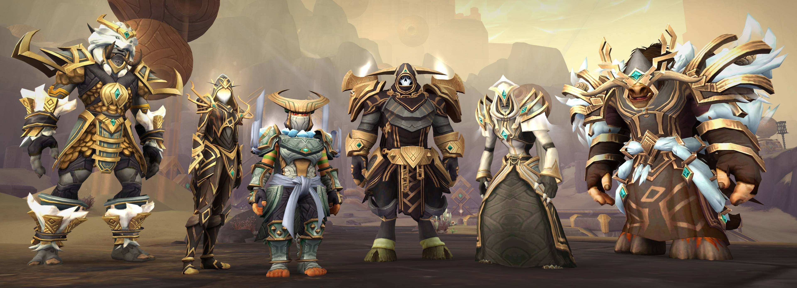

# Dungeon Raiders
###  [View the live project here.](https://mariuszmatysiak.github.io/Dungeon-Raiders/)

### Dungeon Raiders is a website for World of Warcraft gamers focusing the endgame content designed to play as a 5-man group of players- dungeons. The website provides with suggested compositions alongside with tips for all the bosses within 8dungeons. Ulitmate goal of the website is to create a community on discord to both play together and theorycraft. With an option to contact us through the form for those who are looking for a team.

# User Experience (UX)
## User Stories
-----

## User stories
* First Time Visitor Goals
    * As a First Time Visitor, I want to easly understand the main purpose of the site and learn more about the what the site has to offer.
    * As a First Time Visitor, I want to be able to easily navigate throughout the site to find content.
    * As a First Time Visitor, I want to be able to experience site's contents.
* Returning Visitor Goals
    * As a Returning Visitor, I want to find information about certain boss fights.
    * As a Returning Visitor, I want to find information about team compositions.
    * As a Returning Visitor, I want to find the community links to discord and form.
* Frequent User Goals
    * As a Frequent User, I want to revise the tips for certain dungeon/boss fights.
    * As a Frequent User, I want to check if there any new changes among the best compositions.
    * As a Frequent User, I want to be able to submit a form to share my favourite team compositions and join the theorycrafting team on discord.
## Design
* Colour Scheme

    
    * Colours used in this project: Jet- Navigation Bar Colour, White- Font Navigation Bar Colour, Spanish Gray- Font for home guide info, Mandarin- as an Accent Colour, Peach Crayola- as an alternative Accent Colour, 262626 Earie Black- as a Main Background Colour, 1A1A1A Earie Black- as a Footer Background Colour.
* Topography

    * Font Quicksand Regular 400

    

    * Font Incosolata Regular 400

    

    * Font Roboto Thin 100, Regular 400

    

* Imagery
    * I've used three imagery pieces to set the tone and colour pallete of the game, providing hero images for index.html, compositions.html and contact.html 

    

    

    

## Wireframes

### The initial wireframes prior the start of development

* Desktop Wireframe - [Full pdf access here](assets/documentation/desktop-wireframes.pdf)

* Mobile Wireframe - [Full pdf access here](assets/documentation/mobile-wireframes.pdf)

# Features

# Home Page

## Nav Bar

* Navigation Bar has been featured on all four pages. On the desktop view users can experience the full logo in the left segment. Navigation links are provided in the right side of the Navigation Bar with the active one being coloured and underlined. The colour of the link changes uppon hovering.

* On the mobile view users can experience logo miniature in the left segment. Navigation links are provided inside the hamburger button.

* Dropdown menu on the mobile view continues to highlight the current page.

## Hero Image

* Homepage's hero image comes with hook text which is styled with blur and shadow for better user experience reading the content. Desktop view below.

* Mobile view below. 

## Game's Logo

* Two main sections are divided with World of Warcraft: Shadowlands logo.

## Home Guide Info + Animation

* Text informing about the guides and an animation bringing all of the 8 dungeons to the viewers attention in an exciting and dynamic way. View on the desktop.

* View on the Mobile screen:

## Footer

* A responsive text in the footer area provides the right amount of content for desktop and mobile for better visual user experience with a link to the discord channel attached. View on the desktop.

* View on the mobile.

# Compositions Page

* A Hero Image on a Compositions presents a group of heroes encouraging the site Visitor to dig into content. 

* All the compositions are presented with two sets of 5 icons. First set presents role distribution inside the team(Tank- Shield Icon, Healer- Plus Icon, DPS-Sword Icon) and the Second set presents the icons of Character Classes used in a certain composition. View on desktop.

* View on mobile.

# Contact Page 

## Hero Image  
* A Champion presented on the Hero Image represents the role of a recruiter.

## Form 

* 

# Technologies Used

## Languages Used

* [HTML5](https://en.wikipedia.org/wiki/HTML5)
* [CSS3](https://en.wikipedia.org/wiki/CSS)
* [JS](https://en.wikipedia.org/wiki/JavaScript)

# Testing
## Validation Code
### HTML

The [W3C School HTML Validator](https://validator.w3.org/) 

- I fixed errors accured during validation.
- On the [Home Page](assets/documentation/error-validator-html-home.png) there was an error in the credited code from CodePen, there was `
` element inside of `<b>` element. Also `<section>' were missing headings, so I added to the first section, and section with wow logo changed to `<figure>' element, and section with guide info chnaged to `<aside>`.
- On the [Compositions Page](assets/documentation/error-validator-html-comps.png) there was an error with `
` element without closing tag, so I removed it because during content implementation I haven't notice it.
- On the [Dungeons Page](assets/documentation/error-validator-html-dungs.png) there were errors with missing `<alt>` elements in the `` element so I've add it, and warning with section without heading.
- On the [Contant Page](assets/documentation/error-validator-html-contact.png) there were errors with `<aria-placeholder>` and `<required>` element in the form so I removed it.

### CSS

* The [W3C School CSS Validator](https://jigsaw.w3.org/css-validator/)

### JavaScript

* The [JSHint](https://jshint.com/) 

## Testing User Stories from User Experience

### First Time Visitor Goals

* As a First Time Visitor, As a First Time Visitor, I want to easly understand the main purpose of the site and learn more about the what the site has to offer.
    * a
* As a First Time Visitor,  want to be able to easily navigate throughout the site to find content.
    * a
* As a First Time Visitor, I want to be able to experience site's contents.
    * a
### Returning Visitors Goals

* As a Returning Visitor, I want to find information about certain boss fights.
    * a
    * a
* As a Returning Visitor, I want to find information about team compositions.
    * a
    * a
* As a Returning Visitor, I want to find the community links to discord and form.
    * a
    * a

## Further Testing 

 * The Website was tested on Google Chrome, Firefox and Miscrosoft Edge browsers. 
 * The website was viewed on a variety of devices such as Desktop, Laptop, Tablet- Samsung Tab 3, iPhone 12 Pro, iPhone 12 Pro Max.
 * Friends and family members were asked to review the site and documentation to point out any bugs and/or user experience issues. See the results below:
    * 

